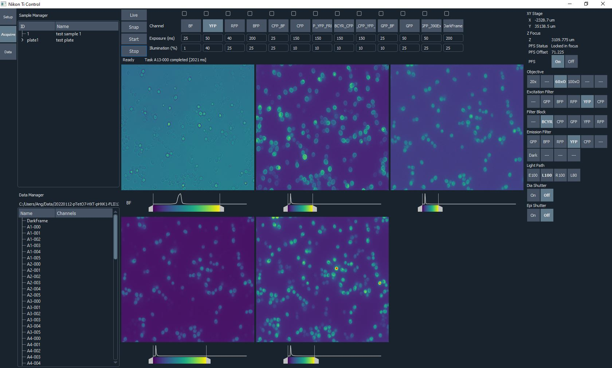

# NikonTiCtrl

Graphical user interface and API for controlling a Nikon Ti-E widefield fluorescence microscope system in the Springer lab at Harvard Medical School.

## Dependencies

### Build Dependencies
* MSVC 2022 (with Git for Windows)
* [Qt](https://www.qt.io/download-open-source) 6.5.2 (with CMake and [Ninja](https://ninja-build.org))
* [vcpkg](https://vcpkg.io) 2023.08.09
* [DCAM-API](https://dcam-api.com) 22.7.6469
* [DCAM-SDK4](https://dcam-api.com/dcam-sdk-login/) 21.6.6291 (download and extract into `third_party/dcamsdk`)
* Micro-Manager 2.0 (e.g. 2.0.1_20220705, a version with Device API version 70, for copying device adapter `mmgr_dal_NikonTI.dll`)
* NI-VISA 21.5

### Runtime Dependencies
* NI-VISA Runtime 21.5
* [DCAM-API](https://dcam-api.com) 22.7.6469 (Camera driver)
* [Ti Control](https://www.nikon.com/products/microscope-solutions/support/download/software/biological/index.htm#toc02) 4.4.6 (Microscope driver) 
* [Nikon Ti SDK Redistributable](https://micro-manager.org/wiki/NikonTI) 4.4.1.714

## Screenshot

