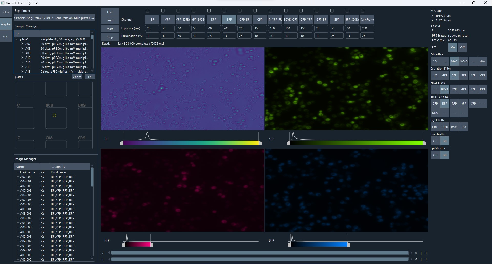

# NikonTiCtrl

Graphical user interface and API for controlling a Nikon Ti-E widefield fluorescence microscope system in the Springer lab at Harvard Medical School.

## Dependencies

### Build Dependencies
* Qt 5.15.2 (with cmake 3.19.0)
* MSVC 2019 (with Git for Windows)
* [Ninja](https://ninja-build.org)
* [vcpkg](https://vcpkg.io) 2022.02.23
* [DCAM-API](https://dcam-api.com) 22.2.6391
* [DCAM-SDK4](https://dcam-api.com/dcam-sdk-login/) 21.6.6291 (download and extract into `third_party/dcamsdk`)
* Micro-Manager 1.4.? (for copying `mmgr_dal_NikonTI.dll` with MD5 `0445e47eeddd4f97bd43b8ee1cc9eaa6`)
* NI-VISA 21.5

### Runtime Dependencies
* NI-VISA Runtime 20.0
* [DCAM-API](https://dcam-api.com) 22.2.6391 (Camera driver)
* [Ti Control](https://www.nikon.com/products/microscope-solutions/support/download/software/biological/index.htm#toc02) 4.4.6 (Microscope driver) 
* [Nikon Ti SDK Redistributable](https://micro-manager.org/wiki/NikonTI) 4.4.1.714

## Screenshot

